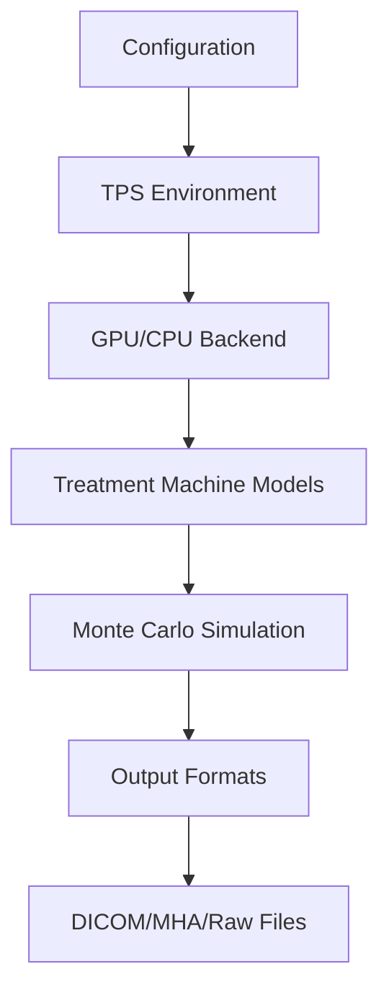

# Moqui DCM Save - Project Improvement Suggestions

## Overview

This document outlines comprehensive suggestions for improving the moqui_dcm_save project based on code analysis, build testing, and runtime evaluation. The suggestions are organized by priority and impact on the project's functionality, maintainability, and production readiness.

## 🏗️ Critical Fixes Required

### 1. CUDA Architecture Configuration Conflict (HIGH PRIORITY)

**Location**: `tps_env/CMakeLists.txt:5` vs `tps_env/CMakeLists.txt:43`

**Issue**: Conflicting CUDA architecture settings
- Line 5: `set(CMAKE_CUDA_ARCHITECTURES 75)` - Correct for RTX 2080 (sm_75)
- Line 43: `set_property(TARGET tps_env PROPERTY CUDA_ARCHITECTURES 86)` - Wrong for RTX 2080 (sm_86 is for RTX 30xx)

**Impact**: Prevents GPU acceleration from working on RTX 2080 hardware
**Current Error**: "no kernel image is available for execution on the device"

**Fix Options**:
```cmake
# Option 1: Remove conflicting line
# Delete line 43 entirely

# Option 2: Correct the architecture
set_property(TARGET tps_env PROPERTY CUDA_ARCHITECTURES 75)
```

### 2. Code Quality Issues (MEDIUM PRIORITY)

**Incomplete Type Warnings** (`mqi_io.hpp`):
```cpp
// Forward declaration without full definition
struct dicom_t;  // Line 21
// But used in functions like save_to_dcm() without full definition
```

**Multi-character Character Constant** (`mqi_tps_env.hpp:805`):
```cpp
logBeamEnergyString.substr(0, logBeamEnergyString.find('.csv') - 1);
// Warning: multi-character character constant
```

**Narrowing Conversions** (Treatment Machine Models):
```cpp
// Conversions from double to float causing precision loss
auto energy = new mqi::norm_1d<T>({s.e}, {energySpread});  // double to float
std::array<T, 6> beamlet_sigm = {spotSize, spotSize, 0, angularSpread, angularSpread, 0};
```

## 🔧 Technical Improvements

### 3. GPU Fallback Mechanism

**Current Issue**: Manual switch to CPU mode required when CUDA fails

**Suggested Implementation**:
```cpp
// In initialization code
bool initialize_compute_device() {
    try {
        if (!initialize_gpu()) {
            log_warning("GPU initialization failed, falling back to CPU mode");
            return initialize_cpu();
        }
        return true;
    } catch (const CUDAError& e) {
        log_error("CUDA Error: %s", e.what());
        log_info("Falling back to CPU mode");
        return initialize_cpu();
    }
}
```

### 4. Enhanced Error Handling

**Current**: Basic error messages
**Suggested**: More descriptive error reporting with recovery suggestions

```cpp
class ErrorHandler {
public:
    static void handle_cuda_error(cudaError_t error, const std::string& context) {
        log_error("CUDA Error in %s: %s", context.c_str(), cudaGetErrorString(error));
        log_info("Suggestions:");
        log_info("  - Check GPU compatibility (CUDA compute capability)");
        log_info("  - Try different GPU ID");
        log_info("  - Use CPU mode with -DGPU=OFF");
        log_info("  - Verify GPU driver is up to date");
    }

    static void handle_dicom_error(const std::string& filename, const std::string& error) {
        log_error("DICOM Error: Failed to load %s", filename.c_str());
        log_error("Details: %s", error.c_str());
        log_info("Suggestions:");
        log_info("  - Verify file exists and is readable");
        log_info("  - Check DICOM file format validity");
        log_info("  - Ensure DCMTK/GDCM libraries are properly installed");
    }
};
```

### 5. Configuration Management

**Current**: Hardcoded paths and settings
**Suggested**: Flexible configuration system

```cpp
class Configuration {
private:
    std::string config_file_path;
    std::map<std::string, std::string> config_values;

public:
    bool load_from_file(const std::string& path);
    bool load_from_env();
    bool validate() const;

    // Getters with defaults
    int get_gpu_id() const { return get_int("GPUID", 0); }
    std::string get_output_dir() const { return get_string("OutputDir", "./output"); }
    bool get_use_gpu() const { return get_bool("UseGPU", true); }
};
```

## 📊 Performance Optimizations

### 6. Build System Improvements

**Parallel Compilation Enhancement**:
```cmake
# Ensure optimal parallel builds
include(ProcessorCount)
ProcessorCount(N)
if(NOT N EQUAL 0)
    set(CMAKE_BUILD_PARALLEL_LEVEL ${N})
    message(STATUS "Building with ${N} parallel jobs")
endif()
```

**Build Caching Integration**:
```cmake
# Optional ccache integration
find_program(CCACHE_PROGRAM ccache)
if(CCACHE_PROGRAM)
    set(CMAKE_C_COMPILER_LAUNCHER ${CCACHE_PROGRAM})
    set(CMAKE_CXX_COMPILER_LAUNCHER ${CCACHE_PROGRAM})
    set(CMAKE_CUDA_COMPILER_LAUNCHER ${CCACHE_PROGRAM})
    message(STATUS "Using ccache for build acceleration")
endif()
```

### 7. Memory Management

**Dynamic Memory Allocation**:
```cpp
class MemoryManager {
private:
    size_t available_memory;
    size_t used_memory;

public:
    bool allocate_simulation_memory(size_t required_size) {
        if (required_size > available_memory) {
            log_error("Insufficient memory: required %zu MB, available %zu MB",
                     required_size / 1024 / 1024, available_memory / 1024 / 1024);
            return false;
        }
        // Implement allocation strategy
        return true;
    }

    void report_memory_usage() const {
        log_info("Memory usage: %zu MB / %zu MB (%.1f%%)",
                used_memory / 1024 / 1024, available_memory / 1024 / 1024,
                100.0 * used_memory / available_memory);
    }
};
```

## 🧪 Testing & Quality Assurance

### 8. Comprehensive Test Suite

**Suggested Test Structure**:
```cpp
// tests/unit/test_treatment_machines.cpp
TEST(GTR2TreatmentMachine, CharacterizeBeamlet) {
    // Test beamlet characterization with known inputs
}

// tests/integration/test_dicom_io.cpp
TEST(DicomIntegration, LoadAndSave) {
    // Test complete DICOM input/output cycle
}

// tests/performance/test_gpu_vs_cpu.cpp
TEST(Performance, GPUvsCPUSpeed) {
    // Benchmark GPU vs CPU performance
}

// tests/regression/test_known_issues.cpp
TEST(Regression, CUDA_ARCH_Conflict) {
    // Test that CUDA architecture conflicts are resolved
}
```

### 9. Continuous Integration Enhancements

**GitHub Actions Workflow**:
```yaml
name: Comprehensive CI
on: [push, pull_request]

jobs:
  test-matrix:
    strategy:
      matrix:
        os: [ubuntu-20.04, ubuntu-22.04]
        gpu: [cpu, gpu]
        build_type: [Debug, Release]

    steps:
    - uses: actions/checkout@v3
    - name: Setup Environment
      run: |
        sudo apt-get update
        sudo apt-get install -y cmake build-essential dcmtk libgdcm-dev

    - name: Build and Test
      run: |
        mkdir build && cd build
        cmake .. -DGPU=${{ matrix.gpu == 'gpu' && 'ON' || 'OFF' }}
        make -j$(nproc)
        ctest --output-on-failure
```

## 📚 Documentation & Usability

### 10. User Documentation Enhancements

**Troubleshooting Guide Section**:
```markdown
## Common Issues and Solutions

### CUDA Kernel Image Not Available
**Error**: "no kernel image is available for execution on the device"

**Solutions**:
1. Check GPU compatibility with `nvidia-smi`
2. Verify CUDA installation: `nvcc --version`
3. Try CPU mode: `cmake .. -DGPU=OFF`
4. Check CMakeLists.txt for architecture conflicts

### Memory Issues
**Error**: Simulation runs out of memory

**Solutions**:
1. Reduce batch size in configuration
2. Use smaller phantom dimensions
3. Enable memory optimization flags
```

### 11. Developer Documentation

**Architecture Overview**:


## 🔍 Diagnostics & Monitoring

### 12. Enhanced Logging System

**Structured Logging Implementation**:
```cpp
enum class LogLevel {
    DEBUG = 0,
    INFO = 1,
    WARNING = 2,
    ERROR = 3
};

class Logger {
public:
    template<typename... Args>
    static void log(LogLevel level, const std::string& format, Args... args) {
        if (level >= current_log_level) {
            auto timestamp = std::chrono::system_clock::now();
            printf("[%s] %s\n",
                   format_timestamp(timestamp).c_str(),
                   format_string(format, args...).c_str());
        }
    }

    static void log_simulation_start(const std::string& config_file) {
        log(INFO, "Starting simulation with config: %s", config_file.c_str());
    }

    static void log_simulation_progress(int completed, int total, double elapsed_time) {
        double progress = 100.0 * completed / total;
        log(INFO, "Progress: %.1f%% (%d/%d) - Elapsed: %.2fs",
            progress, completed, total, elapsed_time);
    }
};
```

### 13. Performance Monitoring

**Real-time Statistics**:
```cpp
class PerformanceMonitor {
private:
    std::chrono::high_resolution_clock::time_point start_time;
    size_t particles_processed;
    size_t memory_usage;

public:
    void start_timing() { start_time = std::chrono::high_resolution_clock::now(); }

    void update_statistics(size_t additional_particles) {
        particles_processed += additional_particles;
        auto current_time = std::chrono::high_resolution_clock::now();
        auto elapsed = std::chrono::duration_cast<std::chrono::milliseconds>(
            current_time - start_time).count() / 1000.0;

        double particles_per_second = particles_processed / elapsed;
        log(INFO, "Performance: %.0f particles/second", particles_per_second);
    }

    void generate_report() const {
        // Generate comprehensive performance report
    }
};
```

## 🚀 Feature Enhancements

### 14. Output Format Flexibility

**Multi-format Support**:
```cpp
enum class OutputFormat {
    DICOM,
    META_IMAGE,  // MHA/MHD
    NIFTI,
    HDF5,
    CSV
};

class OutputWriter {
public:
    bool write_dose_distribution(const DoseData& data,
                                const std::string& filename,
                                OutputFormat format) {
        switch(format) {
            case OutputFormat::DICOM:
                return write_dicom(data, filename);
            case OutputFormat::META_IMAGE:
                return write_meta_image(data, filename);
            case OutputFormat::NIFTI:
                return write_nifti(data, filename);
            // ... other formats
        }
    }
};
```

### 15. Batch Processing System

**Queue Management**:
```cpp
class BatchProcessor {
private:
    std::queue<SimulationTask> task_queue;
    std::vector<std::thread> worker_threads;

public:
    void add_task(const SimulationTask& task) {
        task_queue.push(task);
    }

    void process_all() {
        while (!task_queue.empty()) {
            auto task = task_queue.front();
            task_queue.pop();
            process_single_task(task);
        }
    }

    void process_single_task(const SimulationTask& task) {
        try {
            log(INFO, "Processing task: %s", task.name.c_str());
            auto result = run_simulation(task.config);
            save_result(result, task.output_path);
            log(INFO, "Completed task: %s", task.name.c_str());
        } catch (const std::exception& e) {
            log(ERROR, "Failed task %s: %s", task.name.c_str(), e.what());
        }
    }
};
```

### 16. Multi-GPU Support

**GPU Workload Distribution**:
```cpp
class MultiGPUManager {
private:
    std::vector<int> available_gpus;
    std::vector<CUDAStream> streams;

public:
    bool initialize() {
        int gpu_count = 0;
        cudaGetDeviceCount(&gpu_count);

        for (int i = 0; i < gpu_count; ++i) {
            cudaDeviceProp prop;
            cudaGetDeviceProperties(&prop, i);
            if (prop.computeCapability >= 6.0) {  // Minimum requirement
                available_gpus.push_back(i);
            }
        }

        return !available_gpus.empty();
    }

    void distribute_workload(SimulationWorkload& workload) {
        size_t gpu_count = available_gpus.size();
        size_t work_per_gpu = workload.total_particles / gpu_count;

        for (size_t i = 0; i < gpu_count; ++i) {
            auto sub_workload = workload.split(i * work_per_gpu, work_per_gpu);
            streams.emplace_back(available_gpus[i], sub_workload);
        }
    }
};
```

## 🔒 Production Readiness

### 17. Security Considerations

**Input Validation**:
```cpp
class SecurityValidator {
public:
    static bool validate_dicom_file(const std::string& filename) {
        // Check file path doesn't traverse directories
        if (filename.find("..") != std::string::npos) {
            log(ERROR, "Path traversal attempt detected: %s", filename.c_str());
            return false;
        }

        // Check file size limits
        std::ifstream file(filename, std::ifstream::ate | std::ifstream::binary);
        if (!file.is()) {
            return false;
        }

        size_t file_size = file.tellg();
        const size_t MAX_DICOM_SIZE = 100 * 1024 * 1024;  // 100MB limit

        if (file_size > MAX_DICOM_SIZE) {
            log(ERROR, "File too large: %zu bytes (max: %zu)", file_size, MAX_DICOM_SIZE);
            return false;
        }

        return true;
    }
};
```

### 18. Clinical Validation Framework

**Accuracy Verification**:
```cpp
class ClinicalValidator {
public:
    struct ValidationResults {
        double gamma_index_pass_rate;
        double dose_difference_mean;
        double dose_difference_max;
        bool meets_clinical_requirements;
    };

    static ValidationResults validate_against_reference(
        const DoseDistribution& calculated,
        const DoseDistribution& reference,
        const ValidationCriteria& criteria) {

        ValidationResults results;

        // Implement gamma index analysis
        results.gamma_index_pass_rate = calculate_gamma_index(calculated, reference, criteria);

        // Calculate dose differences
        results.dose_difference_mean = calculate_mean_dose_difference(calculated, reference);
        results.dose_difference_max = calculate_max_dose_difference(calculated, reference);

        // Determine if clinical requirements are met
        results.meets_clinical_requirements =
            results.gamma_index_pass_rate >= criteria.min_gamma_pass_rate &&
            std::abs(results.dose_difference_mean) <= criteria.max_mean_dose_difference;

        return results;
    }
};
```

## 📈 Scalability Improvements

### 19. Distributed Computing Architecture

**Master-Worker Pattern**:
```cpp
class DistributedSimulationNode {
public:
    enum class NodeType { MASTER, WORKER };

private:
    NodeType node_type;
    std::unique_ptr<NetworkManager> network_manager;

public:
    void run_as_master(const std::vector<std::string>& worker_addresses) {
        // Distribute work to workers
        WorkloadDistributor distributor(worker_addresses);
        distributor.distribute_simulation_work(global_workload);

        // Collect results
        ResultCollector collector;
        collector.collect_results(worker_addresses);

        // Aggregate final results
        aggregate_final_results();
    }

    void run_as_worker(const std::string& master_address) {
        // Connect to master
        network_manager->connect_to_master(master_address);

        // Receive work assignment
        auto work_assignment = network_manager->receive_work_assignment();

        // Process assigned work
        auto local_result = process_work_assignment(work_assignment);

        // Send results back to master
        network_manager->send_results(local_result);
    }
};
```

### 20. Configuration Database Integration

**Persistent Configuration Management**:
```cpp
class ConfigurationDatabase {
private:
    std::unique_ptr<SQLiteDatabase> db;

public:
    bool initialize(const std::string& db_path) {
        db = std::make_unique<SQLiteDatabase>(db_path);
        return create_tables();
    }

    bool create_tables() {
        const std::string create_config_table = R"(
            CREATE TABLE IF NOT EXISTS simulation_configs (
                id INTEGER PRIMARY KEY AUTOINCREMENT,
                name TEXT NOT NULL,
                config_data TEXT NOT NULL,
                created_at TIMESTAMP DEFAULT CURRENT_TIMESTAMP,
                modified_at TIMESTAMP DEFAULT CURRENT_TIMESTAMP
            )
        )";

        const std::string create_results_table = R"(
            CREATE TABLE IF NOT EXISTS simulation_results (
                id INTEGER PRIMARY KEY AUTOINCREMENT,
                config_id INTEGER,
                result_path TEXT NOT NULL,
                execution_time REAL,
                status TEXT NOT NULL,
                created_at TIMESTAMP DEFAULT CURRENT_TIMESTAMP,
                FOREIGN KEY (config_id) REFERENCES simulation_configs (id)
            )
        )";

        return db->execute(create_config_table) &&
               db->execute(create_results_table);
    }

    int save_configuration(const std::string& name, const std::string& config_data) {
        std::string sql = "INSERT INTO simulation_configs (name, config_data) VALUES (?, ?)";
        return db->execute_insert(sql, {name, config_data});
    }

    std::vector<SimulationResult> get_results_for_config(int config_id) {
        // Retrieve all simulation results for a given configuration
    }
};
```

## 🎯 Implementation Priority Matrix

| Priority | Phase | Tasks | Estimated Effort | Impact |
|----------|-------|-------|------------------|--------|
| **Critical** | Phase 1 | CUDA architecture fix, GPU fallback, Error handling | 1-2 weeks | **High** |
| **High** | Phase 2 | Code quality, Logging, Basic tests | 2-3 weeks | **High** |
| **Medium** | Phase 3 | Performance optimization, Documentation, Multi-format output | 1-2 months | **Medium** |
| **Low** | Phase 4 | Distributed computing, Clinical validation, Production features | 3+ months | **High** |

## 📋 Next Steps

### Immediate Actions (This Week)
1. Fix CUDA architecture conflict in `tps_env/CMakeLists.txt`
2. Implement basic GPU fallback mechanism
3. Add structured logging throughout the codebase
4. Create comprehensive error messages with suggestions

### Short-term Goals (1 Month)
1. Resolve all compiler warnings
2. Implement comprehensive test suite
3. Add support for additional output formats
4. Create user and developer documentation

### Long-term Vision (3-6 Months)
1. Implement multi-GPU support
2. Add distributed computing capabilities
3. Clinical validation and accuracy verification
4. Production deployment features

## 🔍 Additional Resources

### Tools and Libraries
- **Build Tools**: CMake, Ninja, ccache
- **Testing**: GoogleTest, Google Benchmark, valgrind
- **Documentation**: Doxygen, Sphinx, Markdown
- **CI/CD**: GitHub Actions, GitLab CI
- **Performance**: NVIDIA Nsight, Intel VTune
- **Security**: AddressSanitizer, ThreadSanitizer

### References
- [CUDA Best Practices Guide](https://docs.nvidia.com/cuda/cuda-c-best-practices-guide/)
- [DICOM Standard](https://www.dicomstandard.org/)
- [Medical Physics Quality Assurance](https://www.aapm.org/)
- [High Performance Computing Best Practices](https://hpc.llnl.gov/)

---

*This document should be updated regularly as the project evolves and new requirements emerge. All suggestions are based on current code analysis and may require adaptation based on specific use cases and requirements.*
